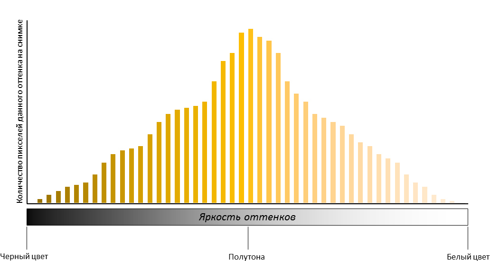
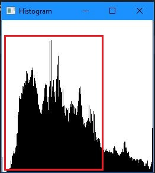
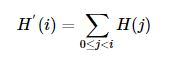
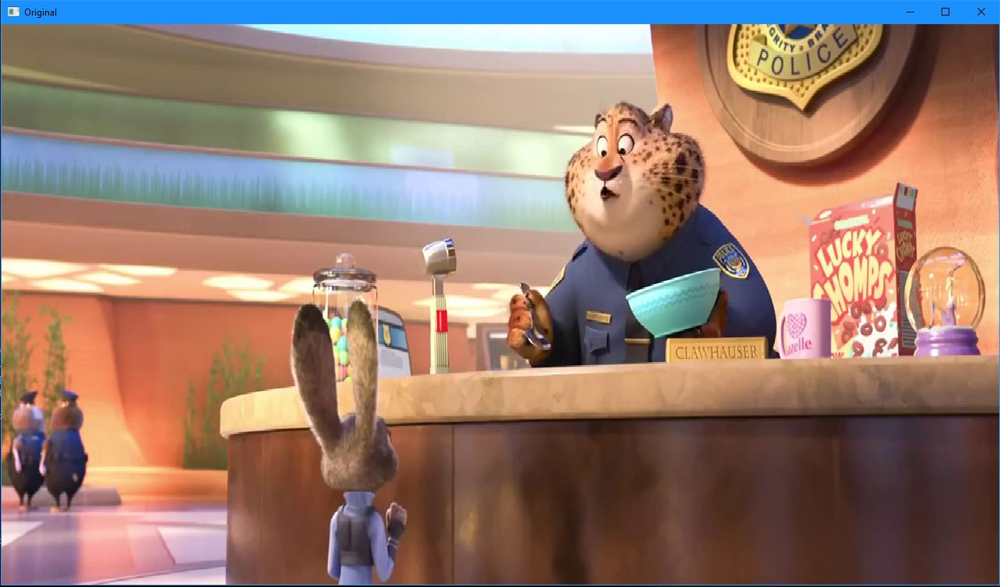
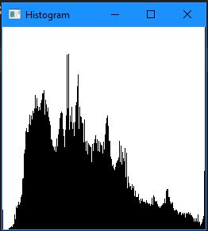
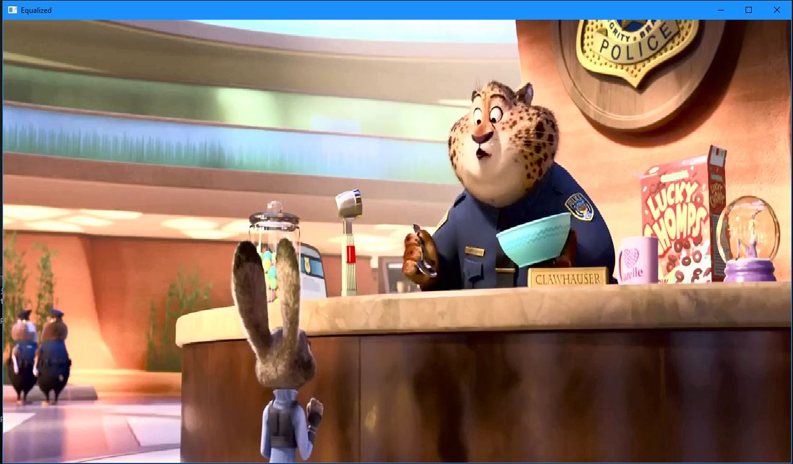
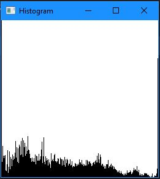

# Лабораторная работа №1

---

## Вариант 2. Эквализация гистограммы

**Вариант задания №2:**

*Эквализация гистограммы. На вход поступает видео, программа на 
выходе отрисовывает два окна: с рассчитанной гистограммой и 
изображением. По нажатию определенной кнопки на клавиатуре 
изображение должно переключаться между исходным и после 
эквализации. Базовый алгоритм - эквализация гистограммы.*

**Цель работы:**

Освоить навык реализации одного из базовых алгоритмов обработки изображений.

**Задание:**

1. Создать программу в соответствии с выбранным заданием. Необходимо реализовать базовый алгоритм в трех вариантах: с использованием встроенных функций из библиотеки (OpenCV, PIL и т.д.), с использованием чистого Python и |с использованием Numba или C++|.
2. Сравнить производительность реализованных вариантов..
3. Создать отчет в формате README на GitHub, который также будет содержать исходный код.

---

## Теоретическая база

**Гистограмма** - это график распределения пикселей с различной яркостью на изображении. График отображает яркость оттенков на изображении на горизонтальной оси, которая охватывает все от самого тёмного до самого светлого. На этой оси расположены столбики, которые показывают количество пикселей каждой яркости. Чем выше столбик, тем больше пикселей с такой яркостью на фотографии. Например, в данном примере графика на снимке наибольшее количество средних по яркости оттенков, т.е. полутонов, а количество тёмных и светлых оттенков невелико.

Рис.1 - Пример гистограммы

Каждое изображение имеет свой уникальный график гистограммы, поскольку оттенки на них располагаются по-разному в разных кадрах. Тем не менее, существуют некоторые общие закономерности, которые можно выделить.

Разберём случай, описанный в нашем исследовании ниже:

**Недоэкспонированный (слишком тёмный) кадр** - На графике гистограммы мы видим, что он сместился влево, что означает, что на фотографии очень много тёмных оттенков, а светлых - практически нет (правая сторона графика пуста). Можно заметить, что на фотографии есть много чёрных пятен, которые лишены деталей, и это явно видно на графике гистограммы, который отображает большое количество чёрного цвета. Это указывает на потерю деталей в тёмных областях изображения, которые заменены чёрными пятнами.

Рис. 2 - Область смещения гистограммы

Для решения данной проблемы можно использовать **эквализацию гистограммы**, то есть выравнивание. Это метод, который улучшает контрастность изображения, чтобы расширить диапазон интенсивности. Эквализация подразумевает *сопоставление* одного распределения (данной гистограммы) с другим распределением (более широким и равномерным распределением значений интенсивности), так что значения интенсивности распределяются по всему диапазону. Для достижения эффекта выравнивания переназначение должно представлять собой *кумулятивную функцию распределения* (cdf)* Для гистограммы H(i), *кумулятивное распределение* H′(i) is:

Рис. 3 - Формула кумулятивной функции

Чтобы использовать это как функцию переназначения, мы должны нормализовать H′(i) так, чтобы максимальное значение было равно 255 (или максимальное значение интенсивности изображения).  В приведенном выше примере кумулятивная функция имеет вид:

Рис. 4 - Пример кумулятивной функции

Наконец, мы используем простую процедуру переназначения, чтобы получить значения интенсивности скорректированного изображения:

$$
equalized(x,y)=H′(src(x,y))
$$

## Описание разработанной системы

---

### Общее описание

Для выполнения задания были написано три скрипта программы на языке Python: основная с использованием библиотеки OpenCV, одна на циклах и дополнительная с компилируемыми функциями при помощи Numba. Компиляция и запуск программ осуществлялись в среде Windows 10.

В основном каталоге проекта можно обнаружить две папки: media и scripts. В папке media находятся входное видео, а в папке scripts располагаются три скрипта:

- main_opencv.py - с использованием библиотеки opencv для рассчёта гистограммы

- main_not_opencv.py - без использования библиотеки opencv для рассчёта гистограммы, реализация базовыми циклами

- main_numba.py - с использованием библиотеки namba для компиляции функциидля рассчёта гистограммы
  
  Три скрипта нужны для сравнения производительности выполняемой задачи

### Алгоритм работы программы

Общее описание алгоритма программы на языке Python выглядит так:

1. Подключаем необходимые библиотеки и модули.
2. Описываем функцию для рассчёта и получения гистограммы
3. Описываем функцию для эквализации изображения
4. Считываем видеофайл и извлекаем фрейм, соответствующий заданной временной метке.
5. Загружаем изображение, которое будет вычитаться из выбранного фрейма видео.
6. Если извлечение фрейма прошло успешно, то подгатавливаем окно для показа оригинального изображения и сразу показываем его
7. Забираем гистограмму эквализированного изображения
8. Подгатавливаем окно для показа гистограммы оригинального изображения и сразу показываем её
9. Эквализируем изображение
10. Устанавливаем обработчик нажатия клавиш с клавиатуры
11. Указываем действие при нажатии клавиши "x" - переключение между оригинальным изображением и его гистограммой и эквализированным изображением и его гистограммой
12. Устанавливаем действие при нажатии клавиши "q" - завершение работы программы
13. После завершения основнго цикла, программа закрывает окна и освобождает занимаемую ими память.

## Результаты работы и тестирования системы

---

Рис.5 - Оригинальное изображение

Рис.6 - Гистограмма оригинального изображения

Рис.7 - Эквализированное изображение

Рис.8 - Гистограмма эквализированного изображения

### Время исполнения операции:

- **OpenCV python:** 0.75 мс

- **Циклы python:** 3692.47 мс

- **Numba Python:** 581.88 мс

## 

## Итог

---

В рамках проекта был создан алгоритм базовой эквализации гистограммы и изображения, используя язык программирования Python с библиотекой OpenCV. Также для ускорения работы программы была применена библиотека numba. Было установлено, что использование оптимизированных библиотечных функций является предпочтительным и значительно ускоряет процесс обработки изображений (в данном проекте практически в 5000 раз).

## Список web-источников

---

- [Что такое гистограмма? / Съёмка для начинающих / Уроки фотографии](https://prophotos.ru/lessons/17582-chto-takoe-gistogramma-uchimsya-chitat-gistogrammu-izobrazheniya)

- [Предобработка данных](http://cs.mipt.ru/advanced_python/lessons/lab27.html)

- [Эквализация гистограмм &ndash; LightHouse Software](https://lhs-blog.info/programming/dlang/ekvalizacziya-gistogramm/)

- [Эквализация гистограмм для повышения качества изображений / Хабр](https://habr.com/ru/post/244507/)

- [OpenCV: Histogram Equalization](https://docs.opencv.org/3.4/d4/d1b/tutorial_histogram_equalization.html)

- [OpenCV Histogram Equalization and Adaptive Histogram Equalization (CLAHE) - PyImageSearch](https://pyimagesearch.com/2021/02/01/opencv-histogram-equalization-and-adaptive-histogram-equalization-clahe/)
